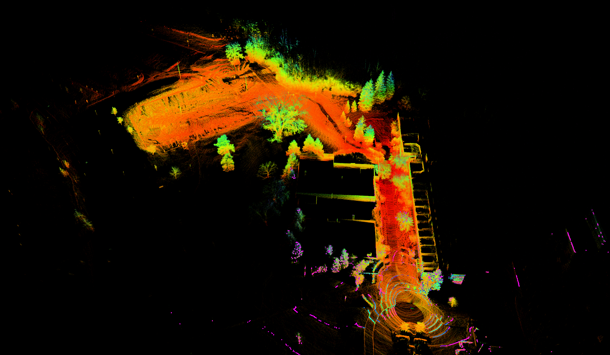

# s_faster_lio

**s_faster_lio (Simple Faster LIO)** is a tightly-coupled LiDAR-IMU odometry.

It is a result of integrating S-FAST_LIO ([link](https://github.com/zlwang7/S-FAST_LIO)) and Faster-LIO ([link](https://github.com/gaoxiang12/faster-lio)).

This project retains most of the content from S-FAST_LIO and **uses the incremental voxel map (IVox) proposed in Faster-LIO to manage point cloud map**, replacing the ikdtree used in the original S-FAST_LIO. 

The IVox class has also been simplified. 



## 1. Prerequisites

### 1.1 **Ubuntu** and **ROS**

Tested on Ubuntu 20.04 + ROS Noetic

**Note:** If your Ubuntu version is earlier than 20.04, you may need to install the TBB library. You can reference the [faster-lio](https://github.com/gaoxiang12/faster-lio).

### 1.2 **PCL & Eigen**

PCL >= 1.8, Eigen >= 3.3.4.

### 1.3 **livox_ros_driver**

Follow the [livox_ros_driver Installation](https://github.com/Livox-SDK/livox_ros_driver).

**Source:** Add the line ``` source $Livox_ros_driver_dir$/devel/setup.bash ``` to the end of the file ``` ~/.bashrc ```, where ``` $Livox_ros_driver_dir$ ``` is the directory of the Livox ROS driver workspace (should be the ``` ws_livox ``` directory if you completely followed the Livox official document).

### 1.4 **Sophus**

```sh
git clone https://github.com/strasdat/Sophus.git
cd Sophus
mkdir build
cd build
cmake ../ -DUSE_BASIC_LOGGING=ON
make
sudo make install
```

## Build

Clone the repository and build it using `catkin_make`:

```sh
git clone to {project_workspace}/src/
cd {project_workspace}
catkin_make
source devel/setup.bash
```

## Run

```sh
roslaunch s_faster_lio mapping_velodyne.launch
rosbag play YOUR_DOWNLOADED.bag
```

## 7. Acknowledgements

Thanks to these authors for their great work and for making their work open source:
[FAST_LIO](https://github.com/hku-mars/FAST_LIO)
[S-FAST_LIO](https://github.com/zlwang7/S-FAST_LIO)
[faster-lio](https://github.com/gaoxiang12/faster-lio)
